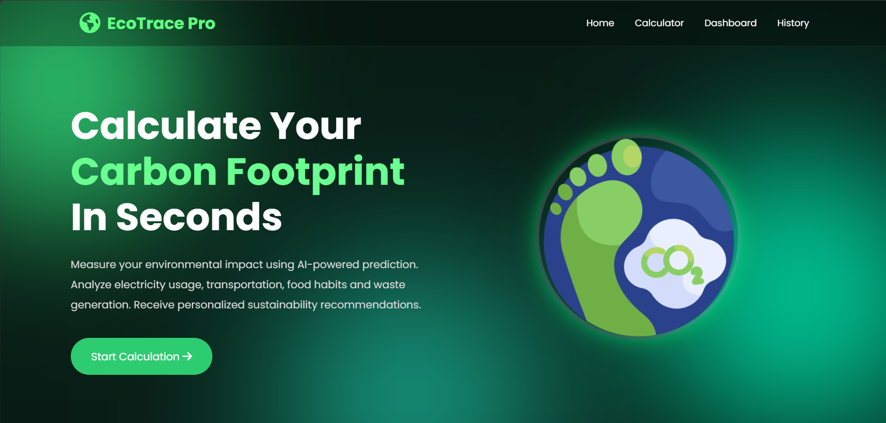

# 🌍 EcoTrace Pro

<div align="center">
<div class="planet">
        
    </div>

### ♻️ AI-Powered Carbon Footprint Calculator

Measure • Analyze • Reduce • Sustain


</div>

---

## 🚀 Overview

EcoTrace Pro is an advanced Carbon Footprint Calculator that helps users measure and reduce their environmental impact through intelligent analysis and interactive visualizations.

### 🌱 Analyze Your Impact Through

- 🚗 Travel Distance
- ⚡ Electricity Usage
- 🥗 Food Habits
- 🗑 Waste Generation

---

## ✨ Features

<table>
<tr>
<td align="center">🌍</td>
<td><b>Carbon Footprint Prediction</b></td>
</tr>
<tr>
<td align="center">📊</td>
<td><b>Interactive Dashboard</b></td>
</tr>
<tr>
<td align="center">📈</td>
<td><b>Real-Time Charts & Analytics</b></td>
</tr>
<tr>
<td align="center">🤖</td>
<td><b>AI-Based Recommendations</b></td>
</tr>
<tr>
<td align="center">🗄️</td>
<td><b>SQLite Data Storage</b></td>
</tr>
<tr>
<td align="center">📄</td>
<td><b>Download Reports</b></td>
</tr>
<tr>
<td align="center">📱</td>
<td><b>Responsive Design</b></td>
</tr>
</table>

---


## 🖼️ Screenshots

### 🏠 Home Page



### 📊 Dashboard


### 🌱 Carbon Analysis


---

## 🛠️ Tech Stack

| Technology | Purpose |
|------------|---------|
| Python | Backend |
| Flask | Web Framework |
| SQLite | Database |
| HTML5 | Structure |
| CSS3 | Styling |
| JavaScript | Functionality |
| Chart.js | Visualizations |
| Scikit-Learn | Machine Learning |

---

## 📂 Project Structure

```bash
EcoTrace-Pro/
│
├── app.py
├── model.py
├── requirements.txt
│
├── models/
│   └── carbon_model.pkl
│
├── templates/
│   └── index.html
│
├── static/
│   ├── style.css
│   ├── script.js
│   └── logo.jpg
│
└── carbon.db
```

## ⚙️ Installation

### Clone Repository

```bash
git clone https://github.com/your-username/EcoTrace-Pro.git
cd EcoTrace-Pro
```

### Create Virtual Environment

```bash
python -m venv venv
```

### Activate Virtual Environment

```bash
venv\Scripts\activate
```

### Install Dependencies

```bash
pip install -r requirements.txt
```

### Train Machine Learning Model

```bash
python model.py
```

### Run Application

```bash
python app.py
```

## 📊 Carbon Rating System

| Rating | Meaning |
|----------|----------|
| 🌱 Excellent | Very Low Carbon Emissions |
| 😊 Good | Sustainable Lifestyle |
| ⚠ Moderate | Improvement Needed |
| 🔥 Critical | High Environmental Impact |

---

## 📈 Features Dashboard

✔ Carbon Prediction

✔ Interactive Graphs

✔ Sustainability Rating

✔ AI Recommendations

✔ History Tracking

✔ Report Download

✔ Responsive Design

✔ Modern Glassmorphism UI

---

## 🎯 Future Enhancements

- 🔐 User Authentication
- 📄 PDF Reports
- 📧 Email Reports
- 🌍 Live Weather API
- ☁ Cloud Deployment
- 🗺 Carbon Tracking Maps
- 🤖 Advanced AI Model
- 📱 Mobile Application

---

## 👩‍💻 Author

### Rutika Patel

🎓 Computer Science Engineer

💻 Python Developer

📊 Data Analytics Enthusiast

🌱 Passionate About Sustainable Technology

---

## ⭐ Support

If you like this project:

```text
⭐ Star the Repository
🍴 Fork the Repository
📢 Share with Friends
```

---

<div align="center">

## 🌍 Together We Can Build A Greener Future 🌱


### ⭐ Thank You For Visiting ⭐

</div>
